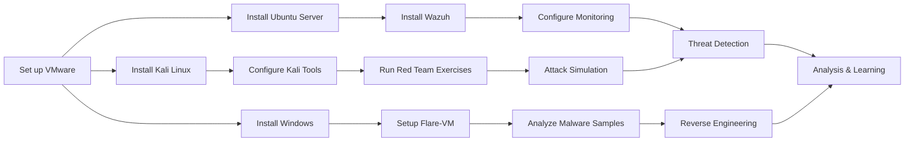

# 🛡️ CyberLabSetup


[](https://opensource.org/licenses/MIT)
[](CONTRIBUTING.md)
[]()

A comprehensive resource for building a hands-on cybersecurity lab using VMware Workstation Pro. This project helps you create a virtualized environment for cybersecurity training and exploration.

## 🔍 Overview

This lab environment includes:
- 🧪 **Kali Linux** with Metasploit for penetration testing (red team exercises)
- 🛡️ **Ubuntu Server** with Wazuh for blue team monitoring and defense
- 🔬 **Windows** with Flare-VM for malware analysis and reverse engineering
- 🌐 Isolated network configuration for safe experimentation

## 📋 Introduction

This guide is designed for cybersecurity enthusiasts, students, and professionals who want to build a hands-on lab environment for practicing offensive and defensive security techniques. By following this guide, you'll create a virtualized lab using VMware Workstation Pro, complete with tools for penetration testing, monitoring, and malware analysis.

```
Red Team + Blue Team + Reverse Engineering = Complete Security Lab
```

## 🚀 Prerequisites

Before you begin, ensure you have the following:

| Requirement | Minimum | Recommended |
|-------------|---------|-------------|
| 💻 Processor | 64-bit x86 | 4+ cores, 2GHz+ |
| 🧠 RAM | 12GB | 24GB+ |
| 💽 Storage | 100GB free | 200GB+ free |
| 🔌 VMware | Workstation Pro/Player | Latest version |
| 📦 ISO images | Kali Linux, Ubuntu, Windows | Latest stable releases |
| 🔑 Windows | Windows 10/11 license | Pro/Enterprise edition |

## ⚡ Quick Start

1. 📥 [Install VMware Workstation Pro](docs/installation/vmware_setup.md)
2. 🐉 [Set Up Kali Linux](docs/installation/kali_setup.md)
3. 🐧 [Set Up Ubuntu Server with Wazuh](docs/installation/ubuntu_wazuh_setup.md)
4. 🪟 [Set Up Windows with Flare-VM](docs/installation/windows_flarevm_setup.md)
5. 🔌 [Configure Networking](docs/networking/network_configuration.md)

## 🔧 Usage

### Red Team Operations
```bash
# Start Metasploit Framework
sudo msfconsole

# Run a basic scan
sudo nmap -sV -sC 192.168.x.x
```

Visit [Red Team Exercises](docs/usage/red_team_exercises.md) for detailed attack simulations.

### Blue Team Monitoring
```bash
# Check Wazuh status
sudo systemctl status wazuh-manager

# View recent alerts
sudo tail -f /var/ossec/logs/alerts/alerts.log
```

Visit [Blue Team Monitoring](docs/usage/blue_team_monitoring.md) for detailed defense techniques.

### Malware Analysis
```powershell
# Start IDA Free (in Windows Flare-VM)
"C:\Program Files\IDA Free\ida64.exe"

# Run PE analysis with PEStudio
"C:\Program Files\PEStudio\pestudio.exe"
```

Visit [Malware Analysis Techniques](docs/usage/malware_analysis.md) for detailed reverse engineering exercises.

## 🏗️ Lab Environment

<div align="center">
  
  <p><i>Note: The diagram will be added soon.</i></p>
</div>

## 🤖 Automation

The `scripts` directory contains helper scripts to automate parts of the setup process:

```bash
# For Kali Linux setup
./scripts/kali_setup.sh

# For Ubuntu Server with Wazuh setup
./scripts/wazuh_setup.sh
```

```powershell
# For Windows Flare-VM setup (run in PowerShell as Administrator)
.\scripts\flarevm_setup.ps1
```

## 🔄 Workflow



## 🤝 Contributing

We welcome contributions to improve this guide! See [CONTRIBUTING.md](CONTRIBUTING.md) for guidelines.

## 📄 License

This project is licensed under the MIT License - see the [LICENSE](LICENSE) file for details.

## 🌟 Acknowledgements

- [Kali Linux](https://www.kali.org/) team for their amazing security distribution
- [Wazuh](https://wazuh.com/) team for their open-source security monitoring solution
- [Flare-VM](https://github.com/mandiant/flare-vm) by Mandiant for reverse engineering tools
- All contributors who have helped improve this guide
